<p align="center">
  
</p>

<br>


<br>

This project builds a complete **end-to-end Data Preprocessing & Feature Engineering pipeline** applied to a Customer Credit Risk dataset (5,000 records × 15 features). It covers acquiring raw data from **three distinct source types** (CSV flat files, JSON documents, and live REST APIs), performing deep data understanding & profiling, handling missing values with multiple imputation strategies, detecting and treating outliers, encoding categorical and numerical variables, applying feature scaling, and executing advanced transformations with engineered features.

The implementation is done in Python using a Jupyter Notebook — **[final.ipynb](final.ipynb)**.

<br>

---


<br>

<p align="left">
  
  
  
  
  
  
  
  
</p>

<br>

---


<br>

### Q1 — What is Data Analysis?

**Data Analysis** is the systematic process of inspecting, cleaning, transforming, and modeling raw data to discover useful information, draw meaningful conclusions, and support decision-making.

| Activity | Description |
|----------|-------------|
| 📥 **Data Collection** | Gathering data from databases, APIs, sensors, and survey instruments |
| 🧹 **Data Cleaning** | Resolving inconsistencies, duplicates, and missing values |
| 🔍 **Exploration (EDA)** | Summarizing characteristics via statistics and visualization |
| 🔄 **Transformation** | Encoding, scaling, and feature-engineering variables |
| 💡 **Interpretation** | Extracting insights through reports, dashboards, and visualizations |

---

### Q2 — How to Plan a Data Science Project

A well-structured Data Science project lifecycle ensures reproducibility, stakeholder alignment, and successful deployment:

| # | Phase | Key Activities |
|---|-------|----------------|
| 1 | 🎯 **Problem Definition** | Define business objective; frame as ML task (classification, regression…) |
| 2 | 📦 **Data Collection** | Gather from structured (CSV, DB), unstructured (text), streaming (API) sources |
| 3 | 🔍 **Data Understanding** | Profile shape, dtypes, nulls, distributions, statistical summaries |
| 4 | 🧹 **Data Preprocessing** | Clean noise, impute nulls, encode categoricals, normalize/scale |
| 5 | ⚙️ **Feature Engineering** | Create ratios, aggregates, polynomial terms, date-parts |
| 6 | 🤖 **Model Selection** | Choose algorithms by task, data size, interpretability |
| 7 | 🏋️ **Model Training** | Train/Validation/Test split; fit on training corpus |
| 8 | 📏 **Model Evaluation** | Accuracy, F1, RMSE, AUC-ROC on held-out set |
| 9 | 🚀 **Deployment** | REST API, embedded system, or dashboard integration |
| 10 | 📡 **Monitoring** | Track model drift and data drift; retrain on schedule |

---

### Q3 — How to Frame ML Problems

Framing a machine learning problem involves:

| Step | Description |
|------|-------------|
| 🎯 **Define the Objective** | Clearly state what you want to predict or optimize |
| 🏷️ **Identify Problem Type** | Classification, Regression, Clustering, etc. |
| 📐 **Specify Input/Output** | Define feature set (X) and target variable (y) |
| 📏 **Determine Metrics** | Choose evaluation metrics (Accuracy, F1, RMSE, AUC-ROC) |
| ⚠️ **Consider Constraints** | Data availability, latency, interpretability requirements |
| 💡 **Formulate Hypotheses** | State assumptions to validate during modeling |

**Applied Example — Credit Default Prediction:**

| Attribute | Detail |
|-----------|--------|
| **Task Type** | Supervised Binary Classification |
| **Target Variable** | `default_flag` → `1` (defaults) / `0` (healthy) |
| **Features** | `age`, `annual_income`, `loan_amount`, `credit_score`, `repayment_history`, etc. |
| **Dataset** | 5,000 records · 15 columns |
| **Algorithms** | Logistic Regression, Random Forest, XGBoost, SVM |
| **Metrics** | Accuracy, Precision, Recall, F1-Score, AUC-ROC |

---

### Q4 — What are Tensors? (with NumPy Examples)

A **Tensor** is a mathematical object that generalizes scalars, vectors, and matrices to *any* number of dimensions (called **rank**).

| Rank | Name | Shape | Real-World Example |
|------|------|-------|---------------------|
| 0 | Scalar | `()` | A single age value: `29` |
| 1 | Vector | `(n,)` | A customer's feature row: `[29, 62000, 15]` |
| 2 | Matrix | `(m, n)` | Dataset table: 5000 customers × 15 features |
| 3 | 3D Tensor | `(d, m, n)` | Monthly snapshots: 12 months × 5000 customers × 15 features |
| 4+ | Higher-rank | `(b, c, h, w)` | Batch of RGB images: 32 × 3 × 224 × 224 |

```python
import numpy as np

scalar = np.array(5)
print(scalar.ndim, scalar.shape)   # 0  ()

vector = np.array([1, 2, 3])
print(vector.ndim, vector.shape)   # 1  (3,)

matrix = np.array([[1, 2], [3, 4]])
print(matrix.ndim, matrix.shape)   # 2  (2, 2)

tensor_3d = np.array([[[1, 2], [3, 4]], [[5, 6], [7, 8]]])
print(tensor_3d.ndim, tensor_3d.shape)  # 3  (2, 2, 2)
```

> 💡 **Why it matters**: Neural network weights, image batches, and text embeddings are all tensors. All backpropagation gradients are computed via tensor algebra.

<br>

---


<br>

### 📥 Part B — Data Acquisition

Three distinct data sources were integrated into pandas DataFrames:

| Source | Format | File / Endpoint | Dataset |
|--------|--------|-----------------|---------|
| 🟢 CSV | Flat file | [customer_credit_risk_dataset.csv](data/customer_credit_risk_dataset.csv) | 5,000 customers · 15 columns |
| 🟡 JSON | Nested document | [customer_metadata.json](data/customer_metadata.json) | Customer metadata (email, city, state) |
| 🔴 REST API | HTTP request | `jsonplaceholder.typicode.com/users` | Live user records |

```python
df = pd.read_csv('data/customer_credit_risk_dataset.csv')

with open("data/customer_metadata.json", "r") as file:
    metadata = json.load(file)
metadata_df = pd.DataFrame(metadata)

api_df = pd.DataFrame(requests.get("https://jsonplaceholder.typicode.com/users").json())
```

<br>

---


<br>

### 🧹 Part C — Data Understanding & Missing Value Imputation

**Dataset Profile (Credit Risk):**

| Column | Type | Non-Null | Missing | Imputation Strategy |
|--------|------|----------|---------|---------------------|
| `customer_id` | int64 | 5000/5000 | 0 | — |
| `age` | float64 | 4750/5000 | **250** | Mean / Median / KNN / MICE |
| `gender` | object | 4850/5000 | **150** | Mode (Most Frequent) |
| `region` | object | 5000/5000 | 0 | — |
| `education_level` | object | 5000/5000 | 0 | — |
| `employment_type` | object | 4750/5000 | **250** | Mode (Most Frequent) |
| `annual_income` | float64 | 4700/5000 | **300** | Mean / Median / KNN / MICE |
| `loan_amount` | float64 | 4800/5000 | **200** | Mean / Median / KNN / MICE |
| `loan_purpose` | object | 5000/5000 | 0 | — |
| `credit_score` | float64 | 4750/5000 | **250** | Mean / Median / KNN / MICE |
| `repayment_history` | int64 | 5000/5000 | 0 | — |
| `transaction_count` | int64 | 5000/5000 | 0 | — |
| `spending_ratio` | float64 | 5000/5000 | 0 | — |
| `join_date` | object | 5000/5000 | 0 | — |
| `default_flag` | int64 | 5000/5000 | 0 | — |

**Imputation Strategies Applied:**

| Strategy | Applied To | Method |
|----------|-----------|--------|
| 📊 **Mean** | `age`, `annual_income` | `SimpleImputer(strategy="mean")` |
| 📏 **Median** | `loan_amount`, `credit_score` | `SimpleImputer(strategy="median")` |
| 🔗 **KNN** | `age`, `annual_income`, `loan_amount`, `credit_score` | `KNNImputer()` |
| 🧬 **MICE** | `age`, `annual_income`, `loan_amount`, `credit_score` | `IterativeImputer(random_state=42)` |
| 📋 **Mode** | `gender`, `employment_type` | `.fillna(.mode()[0])` |

```python
# MICE Imputation (selected for final pipeline)
mice = IterativeImputer(random_state=42)
cols = ["age", "annual_income", "loan_amount", "credit_score"]
df_mice[cols] = mice.fit_transform(df_mice[cols])

# Mode for categorical columns
df_mice["gender"] = df_mice["gender"].fillna(df_mice["gender"].mode()[0])
df_mice["employment_type"] = df_mice["employment_type"].fillna(df_mice["employment_type"].mode()[0])
```

**Auto-Profiling** was generated using **ydata-profiling**:
```python
profile = df.profile_report(title="Customer Credit Risk Dataset Report")
profile
```

<br>

---


<br>

### 📊 Part D — Outlier Detection & Treatment

Four outlier handling techniques were applied:

| Technique | Column | Rule | Implementation |
|-----------|--------|------|----------------|
| 📐 **Z-Score** | `annual_income` | \|z\| < 3 | `stats.zscore()` → remove rows |
| 📦 **IQR** | `loan_amount` | Q1 − 1.5·IQR ≤ x ≤ Q3 + 1.5·IQR | Manual quartile computation |
| 📈 **Percentile** | `loan_amount` | 1st–99th percentile | `quantile(0.01)` / `quantile(0.99)` |
| 🔧 **Winsorization** | `loan_amount` | Cap at 1% tails | `scipy.stats.mstats.winsorize()` |

```python
# Z-Score method
z_scores = stats.zscore(df_mice["annual_income"])
df_mice = df_mice[abs(z_scores) < 3]

# IQR method
Q1 = df_mice["loan_amount"].quantile(0.25)
Q3 = df_mice["loan_amount"].quantile(0.75)
IQR = Q3 - Q1
df_mice = df_mice[(df_mice["loan_amount"] >= Q1 - 1.5 * IQR) & (df_mice["loan_amount"] <= Q3 + 1.5 * IQR)]

# Winsorization
from scipy.stats.mstats import winsorize
df_mice["loan_amount"] = winsorize(df_mice["loan_amount"], limits=[0.01, 0.01])
```

<br>

---


<br>

### 🏷️ Part E — Feature Encoding

#### Categorical Encoding

| Technique | Column(s) | Method |
|-----------|-----------|--------|
| 🔢 **Ordinal Encoding** | `education_level` | Primary → 0, Secondary → 1, Graduate → 2, Post-Graduate → 3 |
| 🏷️ **Label / Binary** | `credit_score` | Threshold at 700 → binary 0/1 |
| 🎯 **One-Hot Encoding** | `region`, `loan_purpose` | `OneHotEncoder(drop="first")` |

```python
# Ordinal Encoding
encoder = OrdinalEncoder(categories=[["Primary","Secondary","Graduate","Post-Graduate"]])
df_mice["education_encoded"] = encoder.fit_transform(df_mice[["education_level"]])

# One-Hot Encoding
ohe = OneHotEncoder(drop="first", sparse_output=False, handle_unknown="ignore")
encoded = ohe.fit_transform(df[["region", "loan_purpose"]])
```

#### Numerical Encoding / Binning

| Technique | Column | Result |
|-----------|--------|--------|
| 🗂️ **Binning** | `annual_income` | Low / Medium / High / Very High |
| 🔲 **Binarization** | `credit_score` | Threshold at 700 |
| 📊 **Quantile Binning** | `annual_income` | Q1-Low / Q2 / Q3 / Q4-High |
| 🤖 **K-Means Binning** | `annual_income` | 4 cluster-based groups |

#### Date Feature Extraction

```python
df["join_date"] = pd.to_datetime(df["join_date"])
df["join_year"]    = df["join_date"].dt.year
df["join_month"]   = df["join_date"].dt.month
df["join_day"]     = df["join_date"].dt.day
df["join_weekday"] = df["join_date"].dt.day_name()
```

<br>

---


<br>

### ⚖️ Part F — Feature Scaling

Five scaling techniques were applied to all numeric columns:

| Technique | Description | Scikit-learn Class |
|-----------|-------------|---------------------|
| 📐 **Z-Score (Standardization)** | Mean = 0, Std = 1 | `StandardScaler()` |
| 📏 **L2 Normalization** | Unit vector normalization | `Normalizer(norm="l2")` |
| 📊 **Min-Max Scaling** | Scale to [0, 1] | `MinMaxScaler()` |
| 🔝 **Max-Abs Scaling** | Scale to [-1, 1] by max absolute | `MaxAbsScaler()` |
| 🛡️ **Robust Scaling** | IQR-based, outlier-resistant | `RobustScaler()` |

**Numeric columns scaled:**
`age`, `annual_income`, `loan_amount`, `credit_score`, `repayment_history`, `transaction_count`, `spending_ratio`

```python
from sklearn.preprocessing import StandardScaler, Normalizer, MinMaxScaler, MaxAbsScaler, RobustScaler

num_cols = ["age","annual_income","loan_amount","credit_score",
            "repayment_history","transaction_count","spending_ratio"]

# Z-Score Scaling
standard_scaler = StandardScaler()
df_standard[num_cols] = standard_scaler.fit_transform(df_standard[num_cols])

# Min-Max Scaling
minmax_scaler = MinMaxScaler()
df_minmax[num_cols] = minmax_scaler.fit_transform(df_minmax[num_cols])
```

<br>

---


<br>

### 🔄 Part G — Advanced Transformations & Feature Engineering

#### Mathematical Transformations

| Transformation | Applied To | Purpose |
|----------------|-----------|---------|
| 📈 **Log (log1p)** | `annual_income` | Reduce right-skew |
| 🔄 **Reciprocal** | `loan_amount` | Invert scale distribution |
| √ **Square Root** | `transaction_count` | Moderate skew reduction |
| 📦 **Box-Cox** | `annual_income` | Optimal power transform (positive data) |
| 📊 **Yeo-Johnson** | `loan_amount` | Power transform (handles negatives) |

```python
# Log Transformation
df_mice["income_log"] = FunctionTransformer(np.log1p).transform(df_mice[["annual_income"]])

# Box-Cox
boxcox = PowerTransformer(method="box-cox", standardize=False)
df_mice["income_boxcox"] = boxcox.fit_transform(df_mice[["annual_income"]]).ravel()

# Yeo-Johnson
yeojohnson = PowerTransformer(method="yeo-johnson", standardize=False)
df_mice["loan_yeojohnson"] = yeojohnson.fit_transform(df_mice[["loan_amount"]]).ravel()
```

#### Composite Pipeline (ColumnTransformer)

```python
preprocessor = ColumnTransformer(transformers=[
    ("income_scaling", StandardScaler(), ["annual_income"]),
    ("loan_scaling", MinMaxScaler(), ["loan_amount"]),
    ("transaction_log", FunctionTransformer(np.log1p), ["transaction_count"])
], remainder="passthrough")

transformed_data = preprocessor.fit_transform(df_mice)
```

#### Engineered Features

| Feature | Formula | Business Meaning |
|---------|---------|-----------------|
| `debt_to_income_ratio` | `loan_amount / annual_income` | Borrower's leverage |
| `avg_monthly_transactions` | `transaction_count / 6` | Activity frequency |
| `spending_to_income_ratio` | `spending_ratio / 100` | Normalized spending behavior |

```python
df_mice["debt_to_income_ratio"]      = df_mice["loan_amount"] / df_mice["annual_income"]
df_mice["avg_monthly_transactions"]  = df_mice["transaction_count"] / 6
df_mice["spending_to_income_ratio"]  = df_mice["spending_ratio"] / 100
```

<br>

---


<br>

### 📊 Key Findings

*   ✔ **Multi-Strategy Imputation**: Four imputation strategies (Mean, Median, KNN, MICE) were compared — **MICE** was selected for the final pipeline as it preserves inter-variable relationships.
*   ✔ **Zero Data Loss**: All 5,000 records preserved — no rows dropped. Missing values across 6 columns handled via imputation.
*   ✔ **Outlier Treatment**: Z-Score, IQR, Percentile clipping, and Winsorization applied — ensuring cleaner distributions for downstream modeling.
*   ✔ **Comprehensive Encoding**: Ordinal, Label, One-Hot, Binning, Binarization, Quantile, and K-Means encoding covered all variable types.
*   ✔ **5 Scaling Methods**: StandardScaler, Normalizer, MinMaxScaler, MaxAbsScaler, and RobustScaler evaluated across all numeric features.
*   ✔ **Power Transformations**: Log, Reciprocal, Square Root, Box-Cox, and Yeo-Johnson applied to reduce skewness.
*   ✔ **Feature Engineering**: Three new business-meaningful features created — `debt_to_income_ratio`, `avg_monthly_transactions`, `spending_to_income_ratio`.
*   ✔ **Date Decomposition**: `join_date` decomposed into year, month, day, and weekday components.
*   ✔ **Final Dataset**: Cleaned, transformed, and exported as [final_cleaned_dataset.csv](final_cleaned_dataset.csv).

### 🎯 Final Conclusion

This project successfully demonstrated an end-to-end data preprocessing and feature engineering workflow on a 5,000-record Customer Credit Risk dataset. By acquiring data from CSV, JSON, and REST API sources, the pipeline covers the most common enterprise data formats. MICE imputation preserved inter-variable correlations while cleanly resolving missing values. Outlier detection via Z-Score, IQR, Percentile, and Winsorization ensured robust distributions. A comprehensive suite of encoding (Ordinal, One-Hot, Binning, K-Means) and scaling (Z-Score, Min-Max, Robust) techniques was applied, followed by power transformations (Box-Cox, Yeo-Johnson) to normalize skewed features. The workflow culminates in engineered features and a production-ready cleaned dataset suitable for any downstream credit risk modeling task.

<br>

---

### 👤 Priyansh Vekariya

*   📍 Ahmedabad, Gujarat, India
*   ⭐ If you found this project useful, give it a star and feel free to fork!
*   📐 **Data Acquisition · Imputation · Outlier Handling · Encoding · Scaling · Feature Engineering**
