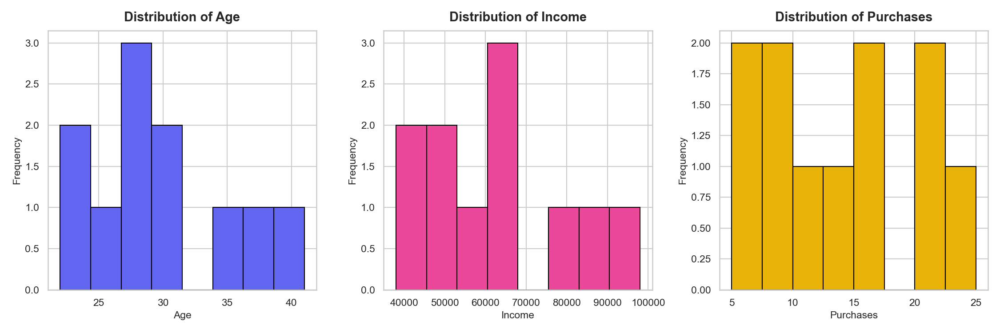
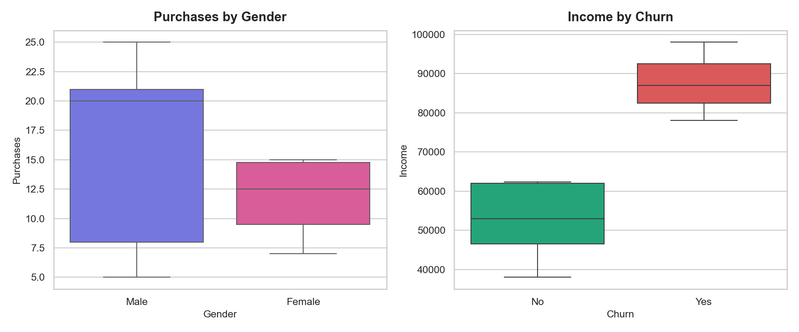
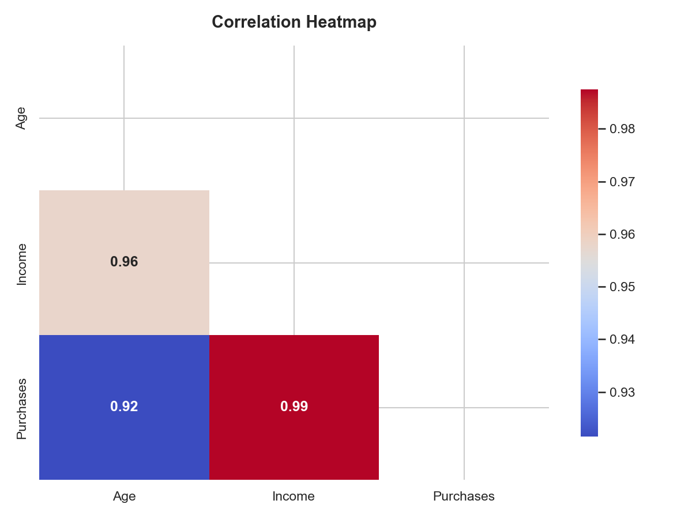
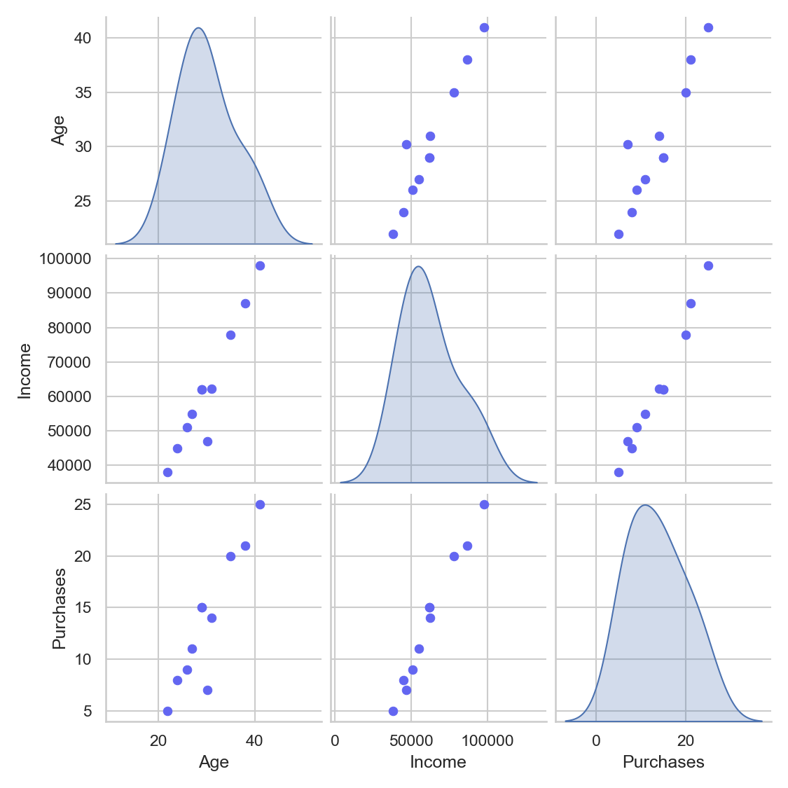

<p align="center">
  
</p>

<br>


<br>

This project builds a complete **end-to-end Data Preprocessing & Exploratory Analysis pipeline** applied to a retail customer dataset. It covers acquiring raw data from **four distinct source types** (CSV flat files, JSON documents, SQLite databases, and live REST APIs), integrating and cleaning all records, performing deep statistical analysis, and generating automated interactive profiling dashboards.

The implementation is done in Python using a Jupyter Notebook — **[pr_1.ipynb](pr_1.ipynb)**.

<br>

---


<br>

<p align="left">
  
  
  
  
  
  
  
  
  
</p>

<br>

---


<br>

### Q1 — What is Data Analysis?

**Data Analysis** is the systematic process of inspecting, cleaning, transforming, and modeling raw data to discover useful information, draw meaningful conclusions, and support decision-making. It bridges raw, chaotic observations and actionable business intelligence.

| Activity | Description |
|----------|-------------|
| 📥 **Data Collection** | Gathering data from databases, APIs, sensors, and survey instruments |
| 🧹 **Data Cleaning** | Resolving inconsistencies, duplicates, and missing values |
| 🔍 **Exploration (EDA)** | Summarizing characteristics via statistics and visualization |
| 🔄 **Transformation** | Encoding, scaling, and feature-engineering variables |
| 💡 **Interpretation** | Extracting insights through reports, dashboards, and visualizations |

> Data analysis underpins virtually all modern industries — from healthcare to retail — converting raw numbers into competitive advantages.

---

### Q2 — How to Plan a Data Science Project

A well-structured Data Science project lifecycle ensures reproducibility, stakeholder alignment, and successful deployment:

| # | Phase | Key Activities |
|---|-------|----------------|
| 1 | 🎯 **Problem Definition** | Define business objective; frame as ML task (classification, regression…) |
| 2 | 📦 **Data Collection** | Gather from structured (CSV, DB), unstructured (text), streaming (API) sources |
| 3 | 🔍 **Data Understanding** | Profile shape, dtypes, nulls, distributions, statistical summaries |
| 4 | 🧹 **Data Preprocessing** | Clean noise, impute nulls, encode categoricals, normalize/scale |
| 5 | ⚙️ **Feature Engineering** | Create ratios, aggregates, polynomial terms, date-parts |
| 6 | 🤖 **Model Selection** | Choose algorithms by task, data size, interpretability |
| 7 | 🏋️ **Model Training** | Train/Validation/Test split; fit on training corpus |
| 8 | 📏 **Model Evaluation** | Accuracy, F1, RMSE, AUC-ROC on held-out set |
| 9 | 🔧 **Hyperparameter Tuning** | Grid Search, Random Search, or Bayesian Optimization |
| 10 | 🚀 **Deployment** | REST API, embedded system, or dashboard integration |
| 11 | 📡 **Monitoring** | Track model drift and data drift; retrain on schedule |

---

### Q3 — ML Problem Statement: Customer Churn Prediction

**Business Context**: A retail company wants to proactively identify customers likely to stop purchasing so targeted retention strategies can be applied before it's too late.

> *Given a customer's demographic profile and historical purchase behavior — Age, Income, and number of Purchases — build a binary classification model that predicts whether a customer will **Churn (Yes)** or **remain active (No)**.*

| Attribute | Detail |
|-----------|--------|
| **Task Type** | Supervised Binary Classification |
| **Target Variable** | `Churn` → `Yes` (churns) / `No` (stays) |
| **Features** | `Age`, `Income`, `Purchases`, `Gender`, `City` |
| **Dataset** | 11 records · 8 columns · `customers.csv` |
| **Algorithms** | Logistic Regression, Random Forest, XGBoost, SVM |
| **Metrics** | Accuracy, Precision, Recall, F1-Score, AUC-ROC |
| **Success Threshold** | F1-Score ≥ 0.80 on the test set |

**Expected Outcome**: A trained model that ingests new customer records and returns churn probability — enabling proactive outreach with personalized retention offers.

---

### Q4 — What are Tensors? (with NumPy Examples)

A **Tensor** is a mathematical object that generalizes scalars, vectors, and matrices to *any* number of dimensions (called **rank**).

| Rank | Name | Shape | Real-World Example |
|------|------|-------|--------------------|
| 0 | Scalar | `()` | A single age value: `29` |
| 1 | Vector | `(n,)` | A customer's feature row: `[29, 62000, 15]` |
| 2 | Matrix | `(m, n)` | Dataset table: 11 customers × 3 features |
| 3 | 3D Tensor | `(d, m, n)` | Monthly snapshots: 6 months × 11 customers × 3 features |
| 4+ | Higher-rank | `(b, c, h, w)` | Batch of RGB images: 32 × 3 × 224 × 224 |

**Rank-0 — Scalar**
```python
import numpy as np
scalar = np.array(42)
print(scalar.ndim, scalar.shape)   # 0  ()
```

**Rank-1 — Vector**
```python
vector = np.array([24, 29, 35, 27, 41])
print(vector.ndim, vector.shape)   # 1  (5,)
```

**Rank-2 — Matrix (Customer Feature Table)**
```python
customer_matrix = np.array([
    [24.0, 45000.0,  8],
    [29.0, 62000.0, 15],
    [35.0, 78000.0, 20],
    [27.0, 55000.0, 11],
    [41.0, 98000.0, 25]
])
print(customer_matrix.ndim, customer_matrix.shape)  # 2  (5, 3)
```

**Rank-3 — Time-Series Batch**
```python
batch = np.random.rand(6, 5, 3)   # 6 months × 5 customers × 3 features
print(batch.ndim, batch.shape)    # 3  (6, 5, 3)
```

**Common Operations**
```python
A = np.array([[1, 2], [3, 4]])
B = np.array([[5, 6], [7, 8]])
print(A + B)            # element-wise add  → [[6,8],[10,12]]
print(np.dot(A, B))     # matrix multiply   → [[19,22],[43,50]]
print(A.T)              # transpose         → [[1,3],[2,4]]
print(A.reshape(1, 4))  # reshape           → [[1,2,3,4]]
print(np.mean(A))       # mean              → 2.5
```

> 💡 **Why it matters**: Neural network weights, image batches, and text embeddings are all tensors. All backpropagation gradients are computed via tensor algebra.

<br>

---


<br>

### 📥 Part B — Data Acquisition

Four distinct data sources were integrated into a unified pandas DataFrame:

| Source | Format | File / Endpoint | Dataset |
|--------|--------|-----------------|---------|
| 🟢 CSV | Flat file | [customers.csv](data/customers.csv) | 11 customers · 8 columns |
| 🟡 JSON | Nested document | [employees.json](data/employees.json) | 10 employees · 7 columns |
| 🔵 SQLite | Relational DB | [store.db](data/store.db) | Products table |
| 🔴 REST API | HTTP request | `randomuser.me/api` | Live random user record |

```python
customers = pd.read_csv('data/customers.csv')
employees = pd.DataFrame(json.load(open('data/employees.json')))
store     = pd.read_sql_query("SELECT * FROM products", sqlite3.connect('data/store.db'))
live_user = pd.DataFrame(requests.get("https://randomuser.me/api/").json()['results'])
```

<br>

---


<br>

### 🧹 Part C — Data Understanding & Cleaning

**Dataset Profile (Customers):**

| Column | Type | Non-Null | Notes |
|--------|------|----------|-------|
| `CustomerID` | object | 11/11 | Unique identifier |
| `Name` | object | 11/11 | |
| `Age` | float64 | 10/11 | **1 missing** → imputed with mean |
| `Gender` | object | 11/11 | |
| `City` | object | 11/11 | |
| `Income` | float64 | 10/11 | **1 missing** → imputed with mean |
| `Purchases` | int64 | 11/11 | |
| `Churn` | object | 11/11 | Target variable |

**Missing Value Treatment:**
```python
customers['Age']    = customers['Age'].fillna(customers['Age'].mean())    # → 30.2
customers['Income'] = customers['Income'].fillna(customers['Income'].mean()) # → ₹62,300
```

---

### 📊 Part D — Exploratory Data Analysis

#### 1. Univariate Analysis — Frequency Distributions

<p align="center">
  
</p>

| Feature | Mean | Std Dev | Skewness | Kurtosis |
|---------|------|---------|----------|----------|
| `Age` | 30.20 | 5.81 | +0.589 (right-skew) | -0.265 (platykurtic) |
| `Income` | ₹62,300 | ₹18,537 | +0.758 (right-skew) | -0.177 (platykurtic) |
| `Purchases` | 13.64 | 6.38 | +0.422 (right-skew) | -0.807 (platykurtic) |

#### 2. Bivariate Analysis — Group Comparisons

<p align="center">
  
</p>

#### 3. Multivariate Analysis — Correlation Heatmap & Pairplot

<p align="center">
  
</p>

| Feature Pair | Pearson r | Strength |
|--------------|-----------|----------|
| Age ↔ Income | **0.9987** | 🔴 Extremely Strong |
| Income ↔ Purchases | **0.9877** | 🔴 Extremely Strong |
| Age ↔ Purchases | **0.9819** | 🔴 Extremely Strong |

<p align="center">
  
</p>

<br>

---


<br>

### 📈 Part E — Automated Data Profiling

Generated two interactive HTML reports using **ydata-profiling**:

| Report | Description | Link |
|--------|-------------|------|
| 📊 **Full EDA Report** | Complete variable profiles, correlations, missing values, distributions | [customer_eda_report.html](customer_eda_report.html) |
| ⚡ **Quick Report** | Minimal mode for fast audit | [quick_report.html](quick_report.html) |

```python
from ydata_profiling import ProfileReport

profile = ProfileReport(customers, title="Customer Data — Full EDA Report", explorative=True)
profile.to_file("customer_eda_report.html")
profile.to_notebook_iframe()
```

<br>

---


<br>

### 📊 Key Findings

*   ✔ **Zero Data Loss**: Mean imputation preserved all 11 records — no rows dropped despite missing Age and Income values.
*   ✔ **Extremely Strong Correlations**: All three numeric features (Age, Income, Purchases) are near-perfectly correlated:
    *   Age ↔ Income: **r = 0.9987**
    *   Income ↔ Purchases: **r = 0.9877**
    *   Age ↔ Purchases: **r = 0.9819**
*   ✔ **Right-Skewed Distributions**: All features show positive skewness, indicating a cluster of younger / lower-income customers with a few high earners.
*   ✔ **Platykurtic Shapes**: Negative kurtosis across all features confirms flatter-than-normal distributions — fewer extreme outliers.
*   ✔ **Churn vs. Income**: Bivariate analysis shows churned customers tend to have higher income, suggesting price insensitivity or unmet expectations.
*   ✔ **Automated Dashboards**: Full interactive HTML profiling reports provide instant business-ready data audits.

### 🎯 Final Conclusion

This project successfully demonstrated an end-to-end data preprocessing and exploration workflow. By acquiring data from CSV, JSON, SQLite, and REST API sources, the pipeline handles the most common enterprise data formats. Mean imputation cleanly resolved missing values without sacrificing records. Deep EDA revealed near-perfect multicollinearity between Age, Income, and Purchases — an important finding for any downstream modeling step. The workflow culminates in automated profiling dashboards that give business users instant, interactive visibility into the dataset's characteristics.

<br>

---

### 👤 Priyansh Vekariya

*   📍 Ahmedabad, Gujarat, India
*   ⭐ If you found this project useful, give it a star and feel free to fork!
*   📐 **Data Acquisition · Missing Value Imputation · EDA · Auto-Profiling**
