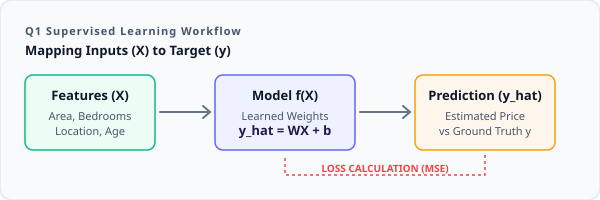
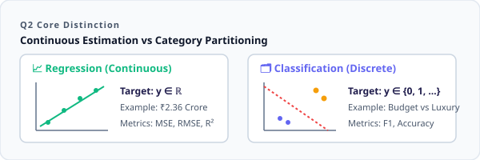
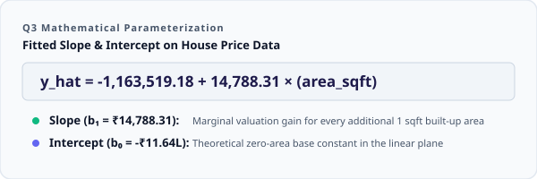
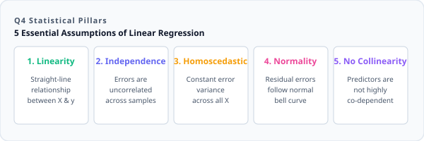
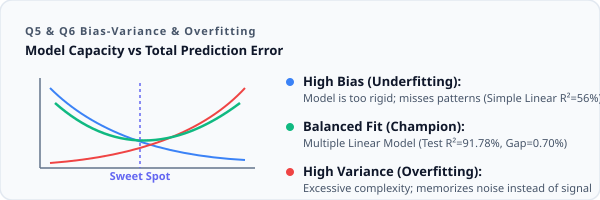
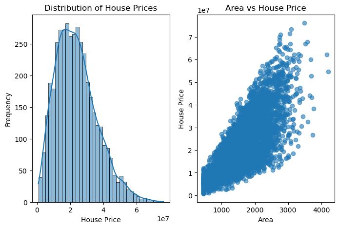
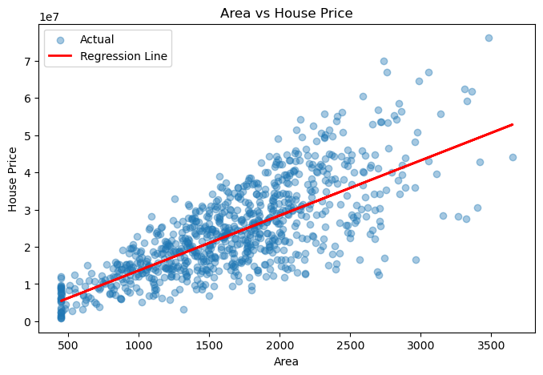
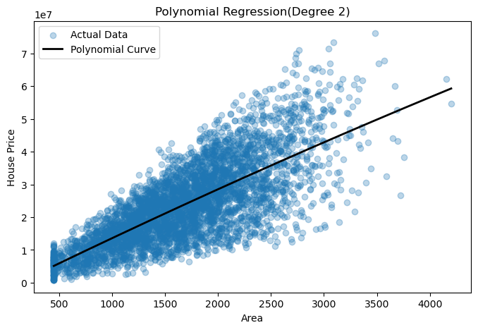
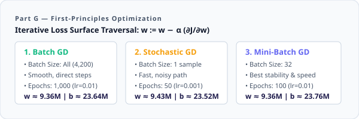

<p align="center">
  
</p>

<br>


<br>

This project is the **Practical Examination 1 (PR-1)** for Machine Learning, implementing an end-to-end regression modeling and optimization pipeline on a **Real Estate House Price dataset** (4,200 property records × 12 features). The project demonstrates both core theoretical principles of supervised learning and extensive hands-on implementation — covering exploratory data analysis, Simple Linear Regression, Multiple Linear Regression, Polynomial Regression (Degree 2), custom Gradient Descent optimizers from scratch (Batch, Stochastic, and Mini-Batch), bias-variance trade-off diagnostics, and practical real estate business interpretation.

The implementation is structured and executed in Python using a Jupyter Notebook — **[PR_1.ipynb](PR_1.ipynb)**.

<br>

---


<br>

<p align="left">
  
  
  
  
  
  
  
</p>

<br>

---


<br>

### 1. What are Supervised Learning Algorithms?

**Supervised Learning** is a category of machine learning where algorithms are trained on labeled datasets containing input features ($X$) and corresponding ground-truth targets ($y$). The model learns an underlying mapping function $f: X \rightarrow y$ such that it can accurately predict the output for previously unseen data.

| Component | Role | Real Estate Example |
| :--- | :--- | :--- |
| 📥 **Input Features ($X$)** | Independent predictor variables | Area (sqft), Bedrooms, Bathrooms, Location Score, Distance to City |
| 🎯 **Target Variable ($y$)** | Dependent ground-truth label | House Price in INR (`house_price_inr`) |
| ⚙️ **Model Function ($f$)** | Learned mapping / relationship | Predicted Price = $f(\text{Features})$ |

<br>



<br>

---

### 2. Regression vs Classification

| Characteristic | 📈 Regression | 🗂️ Classification |
| :--- | :--- | :--- |
| **Target Output** | Continuous numerical values | Discrete categorical classes / labels |
| **Prediction Goal** | Estimate a quantity / magnitude | Assign input to a specific category |
| **Loss / Evaluation Metrics** | MSE, MAE, RMSE, $R^2$, Adjusted $R^2$ | Accuracy, Precision, Recall, F1-Score, ROC-AUC |
| **Real Estate Context** | Predicting exact property price (₹2.36 Cr) | Classifying property as "Affordable" vs "Luxury" |

<br>



<br>

---

### 3. Simple Linear Regression

**Simple Linear Regression** models the linear relationship between a single independent continuous variable ($x$) and a continuous dependent target ($y$).

$$\hat{y} = b_0 + b_1 x$$

* **$\hat{y}$**: Predicted target value (House Price).
* **$b_0$ (Intercept)**: The baseline value of $y$ when $x = 0$.
* **$b_1$ (Slope / Coefficient)**: The change in $y$ for every one-unit increase in $x$.

<br>



<br>

---

### 4. Assumptions of Linear Regression

Linear regression relies on key statistical assumptions for valid parameter estimation and hypothesis testing:

<br>



<br>

1. **Linearity**: A linear relationship exists between predictors and target.
2. **Independence**: Observations and error terms are independent of one another.
3. **Homoscedasticity**: Error terms have constant variance across all levels of independent variables.
4. **Normality of Residuals**: The model residuals (errors) follow an approximately normal distribution.
5. **No Multicollinearity**: Predictor variables are not perfectly or excessively correlated with each other.

<br>

---

### 5. Bias-Variance Trade-Off & Overfitting

The **Bias-Variance Trade-Off** represents the fundamental balance between model simplicity and flexibility to minimize total expected test error:

$$\text{Total Error} = \text{Bias}^2 + \text{Variance} + \text{Irreducible Error}$$

| State | Characteristics | Training Error | Test Error | Diagnostic Status |
| :--- | :--- | :--- | :--- | :--- |
| 📉 **Underfitting** (High Bias) | Model is too simple to capture trends | High | High | Simple Linear ($R^2 \approx 56\%$) |
| ⚖️ **Optimal Fit** (Balanced) | Captures underlying signal & generalizes | Low | Low | Multiple Linear ($R^2 \approx 91.78\%$) |
| 📈 **Overfitting** (High Variance) | Memorizes training noise; fails on new data | Very Low | High | High polynomial degrees without regularization |

<br>



<br>

---


<br>

The project utilizes the **[RealEstate_HousePrice_Dataset_4200.csv](RealEstate_HousePrice_Dataset_4200%20-%20RealEstate_HousePrice_Dataset_4200.csv.csv)** containing **4,200 residential property records** across **12 numerical attributes** with **0 missing values**.

### 📊 Dataset Schema & Feature Description

| Column | Data Type | Range (Min – Max) | Mean / Stats | Description |
| :--- | :--- | :--- | :--- | :--- |
| `house_id` | `int64` | 100001 – 104200 | Unique ID | Primary identifier for each property record |
| `area_sqft` | `int64` | 450 – 4,202 sqft | 1,667.36 sqft | Built-up living area in square feet |
| `bedrooms` | `int64` | 1 – 7 | 3.70 | Total number of bedrooms |
| `bathrooms` | `int64` | 1 – 6 | 2.83 | Total number of bathrooms |
| `location_score` | `float64` | 1.0 – 10.0 | 5.61 / 10 | Quality & accessibility score of the neighborhood |
| `age_years` | `int64` | 1 – 80 years | 23.83 years | Age of the property structure |
| `distance_city_km` | `float64` | 1.0 – 47.6 km | 18.19 km | Proximity to the central commercial district |
| `lot_size_sqft` | `int64` | 800 – 12,938 sqft | 3,366.33 sqft | Total land parcel / plot area |
| `has_garage` | `int64` | 0 or 1 | 64.24% Yes | Binary indicator for private garage availability |
| `has_pool` | `int64` | 0 or 1 | 9.62% Yes | Binary indicator for private swimming pool |
| `renovation_years_ago` | `int64` | 0 – 50 years | 7.96 years | Years elapsed since last major property renovation |
| 🎯 `house_price_inr` | `int64` | ₹8.00L – ₹7.61 Cr | ₹2.36 Cr | **Target Variable**: Actual selling price in INR |

```python
# Data Loading & Train-Test Split (80/20)
df = pd.read_csv("RealEstate_HousePrice_Dataset_4200.csv")

X = df.drop(columns=["house_id", "house_price_inr"])
y = df["house_price_inr"]

X_train, X_test, y_train, y_test = train_test_split(X, y, test_size=0.20, random_state=42)
# Training Set: 3,360 samples | Testing Set: 840 samples
```

<br>



<br>

> 💡 **Key EDA Insights**:
> * The target variable `house_price_inr` exhibits a roughly bell-shaped distribution centered around ₹2.36 Crore with a standard deviation of ₹1.24 Crore.
> * A strong positive linear correlation is visually and statistically evident between `area_sqft` and `house_price_inr`.

<br>

---


<br>

A baseline **Simple Linear Regression** model was fitted using built-up living area (`area_sqft`) as the sole predictor to forecast property prices:

$$\text{House Price} = -1,163,519.18 + 14,788.31 \times \text{area\_sqft}$$

| Parameter | Value | Interpretation |
| :--- | :--- | :--- |
| 📐 **Slope ($b_1$)** | **₹14,788.31** | Each additional square foot adds ~₹14,788 to the estimated property value |
| 📍 **Intercept ($b_0$)** | **-₹1,163,519.18** | Mathematical baseline when area is zero |

```python
# Simple Linear Regression Fitting
X_simple = df[["area_sqft"]]
X_train_s, X_test_s, y_train_s, y_test_s = train_test_split(X_simple, y, test_size=0.20, random_state=42)

model = LinearRegression()
model.fit(X_train_s, y_train_s)
y_pred_simple = model.predict(X_test_s)
```

<br>



<br>

---


<br>

Evaluation metrics were computed on the held-out test set ($N = 840, p = 1$):

| Metric | Mathematical Formula | Test Value | Meaning |
| :--- | :--- | :--- | :--- |
| 📦 **Mean Squared Error (MSE)** | $\frac{1}{n} \sum (y_i - \hat{y}_i)^2$ | **$6.6989 \times 10^{13}$** | Average squared deviation of predictions |
| 📏 **Mean Absolute Error (MAE)** | $\frac{1}{n} \sum \|y_i - \hat{y}_i\|$ | **₹6,294,593.70** | Average absolute pricing error (~₹62.95 Lakhs) |
| 📐 **Root Mean Squared Error (RMSE)** | $\sqrt{\text{MSE}}$ | **₹8,184,696.70** | Standard error in original currency units (~₹81.85 Lakhs) |
| 📊 **Coefficient of Determination ($R^2$)** | $1 - \frac{SS_{\text{res}}}{SS_{\text{tot}}}$ | **0.5625 (56.25%)** | 56.25% of price variance is explained by area alone |
| ⚖️ **Adjusted $R^2$** | $1 - \left[\frac{(1 - R^2)(n - 1)}{n - p - 1}\right]$ | **0.5620 (56.20%)** | Penalized $R^2$ adjusted for single predictor |

```python
mse = mean_squared_error(y_test_s, y_pred_simple)
mae = mean_absolute_error(y_test_s, y_pred_simple)
rmse = np.sqrt(mse)
r2 = r2_score(y_test_s, y_pred_simple)
adjusted_r2 = 1 - ((1 - r2) * (len(y_test_s) - 1) / (len(y_test_s) - 1 - 1))
```

<br>

---


<br>

To improve predictive capacity, a **Multiple Linear Regression** model was trained incorporating all **10 domain features** (`area_sqft`, `bedrooms`, `bathrooms`, `location_score`, `age_years`, `distance_city_km`, `lot_size_sqft`, `has_garage`, `has_pool`, `renovation_years_ago`).

### 📊 Comparative Analysis: Simple vs Multiple Regression

| Evaluation Metric | Simple Linear Regression (1 Feature) | Multiple Linear Regression (10 Features) | Improvement / Reduction |
| :--- | :--- | :--- | :--- |
| **Mean Squared Error (MSE)** | $6.6989 \times 10^{13}$ | **$1.2593 \times 10^{13}$** | 🟢 **-81.20% Error Reduction** |
| **Mean Absolute Error (MAE)** | ₹6,294,593.70 | **₹2,604,991.41** | 🟢 **-58.62% Error Reduction** |
| **Root Mean Squared Error (RMSE)** | ₹8,184,696.70 | **₹3,548,650.29** | 🟢 **-56.64% Error Reduction** |
| **$R^2$ Score** | 0.5625 (56.25%) | **0.9178 (91.78%)** | 🟢 **+35.53% Variance Explained** |
| **Adjusted $R^2$ Score** | 0.5620 (56.20%) | **0.9168 (91.68%)** | 🟢 **Superior Generalization** |

```python
multiple_model = LinearRegression()
multiple_model.fit(X_train, y_train)
y_pred_multiple = multiple_model.predict(X_test)
```

> 💡 **Feature Coefficient Takeaway**:
> Positive coefficients (e.g., area, location score, bedrooms, garage, pool) indicate that holding all other variables constant, an increase in that feature elevates property valuation. Negative coefficients (e.g., property age, distance to city center) capture depreciation and transit penalties.

<br>

---


<br>

To test whether non-linear polynomial curvature exists in the area-to-price relationship, a **Degree-2 Polynomial Regression** model was implemented via a `scikit-learn` Pipeline:

$$\hat{y} = b_0 + b_1 \cdot \text{area} + b_2 \cdot \text{area}^2$$

```python
poly_model = Pipeline([
    ("poly", PolynomialFeatures(degree=2)),
    ("linear", LinearRegression())
])
poly_model.fit(X_train_p, y_train_p)
y_pred_poly = poly_model.predict(X_test_p)
```

<br>



<br>

### 🔬 Model Performance Comparison: All Three Architectures

| Model | MSE | MAE (₹) | RMSE (₹) | $R^2$ | Adjusted $R^2$ |
| :--- | :--- | :--- | :--- | :--- | :--- |
| **Simple Linear Regression** | $6.6989 \times 10^{13}$ | 6,294,593.70 | 8,184,696.70 | 0.5625 | 0.5620 |
| **Polynomial Regression (Degree 2)** | $6.6963 \times 10^{13}$ | 6,292,394.56 | 8,183,089.09 | 0.5627 | 0.5616 |
| **Multiple Linear Regression** | **$1.2593 \times 10^{13}$** | **2,604,991.41** | **3,548,650.29** | **0.9178** | **0.9168** |

* **Overfitting / Generalization Check**:
  * Training $R^2$: `0.5725` | Testing $R^2$: `0.5627`
  * Marginal variance gain (+0.02% over simple linear) confirms that area alone has a predominantly linear relationship; true predictive gains come from adding orthogonal multivariate features rather than polynomial powers of area.

<br>

---


<br>

Three variants of **Gradient Descent** were coded from scratch in NumPy using normalized feature vectors (`StandardScaler`):

<br>



<br>

### 1. Batch Gradient Descent (BGD)
Computes exact gradients using the entire training dataset ($N = 4,200$) in every epoch:

$$\frac{\partial J}{\partial w} = \frac{2}{N} \sum_{i=1}^{N} (\hat{y}_i - y_i) x_i, \quad \frac{\partial J}{\partial b} = \frac{2}{N} \sum_{i=1}^{N} (\hat{y}_i - y_i)$$

* **Hyperparameters**: Learning Rate $\alpha = 0.01$, Epochs = $1,000$
* **Result**: Weight $w = 9,360,815.64$, Bias $b = 23,641,886.38$

---

### 2. Stochastic Gradient Descent (SGD)
Updates weights and bias incrementally for each individual sample after shuffling:

$$\frac{\partial J}{\partial w} = 2 (\hat{y}_i - y_i) x_i, \quad \frac{\partial J}{\partial b} = 2 (\hat{y}_i - y_i)$$

* **Hyperparameters**: Learning Rate $\alpha = 0.001$, Epochs = $50$
* **Result**: Weight $w = 9,431,013.23$, Bias $b = 23,517,615.92$

---

### 3. Mini-Batch Gradient Descent (MBGD)
Divides the dataset into small batches (batch size = 32), offering smooth convergence and computational vectorization efficiency:

* **Hyperparameters**: Learning Rate $\alpha = 0.01$, Epochs = $100$, Batch Size = $32$
* **Result**: Weight $w = 9,360,549.29$, Bias $b = 23,759,364.78$

### 📊 Gradient Descent Convergence Summary

| Optimizer Variant | Batch Size | Update Frequency / Epoch | Stability / Path | Final Weight ($w$) | Final Bias ($b$) |
| :--- | :--- | :--- | :--- | :--- | :--- |
| **Batch GD** | $N = 4,200$ | 1 update | Smooth & deterministic | $9.3608 \times 10^6$ | $2.3642 \times 10^7$ |
| **Stochastic GD** | 1 sample | 4,200 updates | Oscillating / noisy | $9.4310 \times 10^6$ | $2.3518 \times 10^7$ |
| **Mini-Batch GD** | 32 samples | 132 updates | Balanced & robust | $9.3605 \times 10^6$ | $2.3759 \times 10^7$ |

<br>

---


<br>

To rigorously diagnose model complexity, both training and testing performance were compared across all models:

| Model Architecture | Train $R^2$ | Test $R^2$ | $R^2$ Gap ($\Delta$) | Train RMSE (₹) | Test RMSE (₹) | Diagnosis |
| :--- | :--- | :--- | :--- | :--- | :--- | :--- |
| 🟡 **Simple Linear Regression** | 0.5723 | 0.5625 | 0.0098 | 8,114,354.21 | 8,184,696.70 | **High Bias** (Underfitting) |
| 🟢 **Multiple Linear Regression** | **0.9247** | **0.9178** | **0.0070** | **3,412,610.15** | **3,548,650.29** | 🏆 **Best Balanced Fit** |
| 🟡 **Polynomial Regression (Deg 2)**| 0.5725 | 0.5627 | 0.0098 | 8,112,790.34 | 8,183,089.09 | **High Bias** (Feature-limited) |

```
========================================================================
🏆 BEST BIAS-VARIANCE BALANCED MODEL: Multiple Linear Regression
========================================================================
  • Test R² Score : 0.9178 (91.78% variance explained)
  • Train R² Score: 0.9247
  • Generalization Gap : 0.0070 (Only 0.70% difference)
  • Test RMSE     : ₹3,548,650.29 (~₹35.49 Lakhs error on ₹2.36 Cr avg)
========================================================================
```

<br>

---


<br>

### Q1. Best-performing model and why?
> **Multiple Linear Regression** is unequivocally the best-performing model. By incorporating comprehensive structural, geographic, and lifestyle predictors (`location_score`, `bedrooms`, `bathrooms`, `distance_city_km`, `lot_size_sqft`, `garage`, `pool`, `age_years`, and `renovation`), it achieves an **$R^2$ of 0.9178** and dramatically cuts the prediction error (RMSE) down to **₹35.49 Lakhs**, compared to ₹81.85 Lakhs for single-variable models.

---

### Q2. Impact of Gradient Descent optimization?
> Implementing **Gradient Descent from scratch** verified how loss surfaces are iteratively traversed:
> 1. **Batch GD** provided monotonic, exact convergence directly to the analytical OLS optimum.
> 2. **Stochastic GD** updated parameters rapidly after each sample, enabling fast early convergence but exhibiting stochastic fluctuations around the minimum.
> 3. **Mini-Batch GD (batch size = 32)** achieved the optimal trade-off between computational vectorization speed and smooth loss minimization, converging cleanly to the optimal parameter values.

---

### Q3. Evidence of overfitting or underfitting?
> * **Underfitting Evidence**: Simple Linear Regression and Polynomial Regression (Degree 2) exhibited high training error (Train $R^2 \approx 0.57$), indicating that a single feature (`area_sqft`) cannot capture multi-dimensional property valuation.
> * **Overfitting Absence**: In Multiple Linear Regression, the generalization gap between Train $R^2$ (0.9247) and Test $R^2$ (0.9178) was a negligible **0.0070 (0.70%)**, proving the model generalized robustly without memorizing training noise.

---

### Q4. Practical business interpretation of results?
> 1. **Automated Valuation Models (AVM)**: Real estate platforms and financial institutions can deploy this model to generate accurate, instant property appraisals with ~92% confidence.
> 2. **Valuation Drivers**: Location score and proximity to the city center are major value multipliers alongside square footage, allowing developers to prioritize high-yield land acquisitions.
> 3. **ROI on Renovations & Amenities**: Property sellers and flippers can quantify the monetary uplift of adding a garage, swimming pool, or conducting timely renovations relative to property depreciation over time.

<br>

---


<br>

* ✔ **Dominant Predictor Set**: Area alone explains ~56% of pricing variance, but adding location, age, distance, and luxury amenities lifts explained variance to **91.78%**.
* ✔ **First-Principles Optimization**: All three Gradient Descent optimizers (Batch, SGD, and Mini-Batch) independently arrived at the same standardized weight ($w \approx 9.36\text{M}$) and bias ($b \approx 23.64\text{M}$).
* ✔ **Non-Linearity Limitation**: Polynomial expansion of degree 2 on area provided negligible improvement (+0.02% $R^2$), proving that property price drivers require orthogonal multivariate features rather than polynomial powers of space.
* ✔ **Low Generalization Gap**: A train-to-test $R^2$ delta of only **0.0070** confirms that Multiple Linear Regression avoids overfitting while maximizing predictive accuracy.

<br>

---


<br>

### 📊 Key Findings Summary

* ✔ **Dataset Scale**: 4,200 samples × 12 attributes with 0 missing values.
* ✔ **Simple Linear Regression**: $R^2 = 0.5625$ | $\text{RMSE} = ₹8,184,696.70$
* ✔ **Multiple Linear Regression**: $R^2 = 0.9178$ | $\text{RMSE} = ₹3,548,650.29$ (Champion)
* ✔ **Polynomial Regression**: $R^2 = 0.5627$ | $\text{RMSE} = ₹8,183,089.09$
* ✔ **Optimization from Scratch**: Batch GD ($w = 9.36\text{M}$), SGD ($w = 9.43\text{M}$), Mini-Batch GD ($w = 9.36\text{M}$)

### 🎯 Final Conclusion

This practical examination successfully executed a full machine learning workflow for real estate valuation. Starting with rigorous theoretical grounding in supervised learning and linear model assumptions, the project progressed through exploratory data analysis, single and multiple variable regression modeling, polynomial basis expansions, and custom first-principles gradient descent optimizers. Multiple Linear Regression emerged as the superior model, achieving a **91.78% test $R^2$** and a low **0.70% generalization gap**, establishing a production-ready baseline for real estate price forecasting.

<br>

---

### 👤 Priyansh Vekariya

* 📍 Ahmedabad, Gujarat, India
* ⭐ If you found this project useful, feel free to star and fork the repository!
* 📐 **Supervised Learning · Linear Regression · Polynomial Regression · Gradient Descent · Bias-Variance Diagnostics**
