<p align="center">
  
</p>

<br>


<br>

**Practical Examination 2 (PR-2)** focuses on advanced regression, regularization, cross-validation, and ensemble modeling using an **Advanced Real Estate dataset** (3,800 records × 12 features). The project evaluates 7 machine learning architectures — from regularized linear models (Ridge & Lasso) to non-linear tree ensembles (Random Forest) and Support Vector Regression (SVR).

All experiments and code are executed in **[Pr-2.ipynb](Pr-2.ipynb)**.

<br>

---


<br>

<p align="left">
  
  
  
  
  
  
  
</p>

<br>

---


<br>

### 1. Regularization
Regularization adds a penalty term $\lambda \cdot \Omega(w)$ to the loss function to penalize extreme weights, prevent overfitting, and handle multicollinearity:

$$\mathcal{L}_{\text{Reg}} = \mathcal{L}_{\text{MSE}} + \lambda \cdot \Omega(w)$$

* **Without Regularization (OLS)**: High variance, unstable coefficients when features correlate.
* **With Regularization**: Controlled parameter magnitudes, improved test set generalization.

---

### 2. Ridge ($L_2$) vs Lasso ($L_1$)

<br>

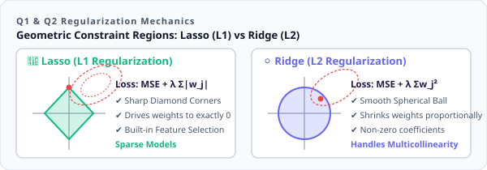

<br>

| Feature | ⚪ Ridge Regression ($L_2$) | 💎 Lasso Regression ($L_1$) |
| :--- | :--- | :--- |
| **Penalty** | Squared $L_2$ norm: $\lambda \sum w_j^2$ | Absolute $L_1$ norm: $\lambda \sum \|w_j\|$ |
| **Constraint Shape** | Circular / Spherical boundary | Diamond / Polytope boundary |
| **Sparsity** | Shrinks weights close to 0 (never exact 0) | Sets non-informative weights to **exact 0** |
| **Best For** | Many collinear, informative features | Feature selection / sparse feature spaces |

---

### 3. Cross-Validation Strategies

Cross-validation mitigates train-test split bias and validates hyperparameter choices reliably across multiple data folds.

<br>

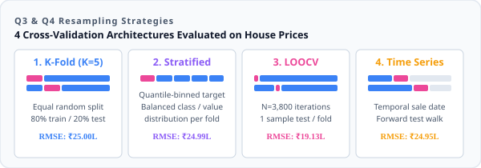

<br>

* **K-Fold**: Randomly splits data into $K$ equal subsets; iterates validation across all folds.
* **Stratified K-Fold**: Preserves target value distributions across folds (binned via quantiles for regression).
* **LOOCV**: Extreme K-Fold where $K=N$; trains on $N-1$ samples and tests on 1.
* **Time Series Split**: Forward-chaining validation respecting temporal order without future data leakage.

---

### 4. Tree-Based Models & Feature Scaling

<br>

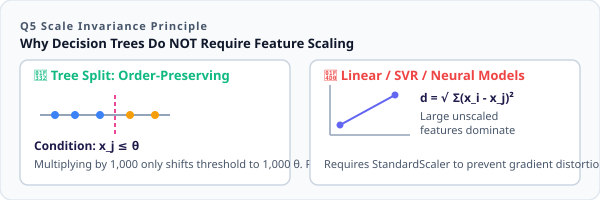

<br>

* **Split Mechanism**: Decision Trees make axis-aligned splits based on threshold sorting ($x_j \le \theta$).
* **Scale Invariance**: Monotonic transformations do not alter sample order or optimal split points; hence, normalization (e.g. `StandardScaler`) is **not required** for tree models.

<br>

---


<br>

The dataset contains **3,800 records** and **12 features** with **zero missing values**.

| Column | Type | Range | Mean | Description |
| :--- | :--- | :--- | :--- | :--- |
| `property_id` | `int64` | 200001 – 203800 | Unique ID | Identifier (dropped before modeling) |
| `sale_date` | `object` | 2010 – 2020 | Date | Split into `sale_year`, `sale_month`, `sale_day` |
| `area_sqft` | `int64` | 500 – 3,776 sqft | 1,716.9 sqft | Built-up living area |
| `bedrooms` | `int64` | 1 – 7 | 3.43 | Bedroom count |
| `bathrooms` | `int64` | 1 – 6 | 2.92 | Bathroom count |
| `location_score` | `float64` | 1.0 – 10.0 | 6.50 / 10 | Neighborhood infrastructure rating |
| `property_age` | `int64` | 1 – 80 yrs | 22.5 yrs | Construction age |
| `distance_city_km`| `float64` | 1.0 – 38.7 km | 13.09 km | Distance to commercial center |
| `near_school` | `int64` | 0 or 1 | 54.8% Yes | School proximity flag |
| `near_metro` | `int64` | 0 or 1 | 47.3% Yes | Metro proximity flag |
| `crime_rate_index`| `float64` | 0.5 – 12.0 | 4.24 | Local crime frequency rating |
| 🎯 `house_price_inr` | `int64` | ₹15.06L – ₹5.93 Cr | **₹2.07 Cr** | **Target variable**: Selling price in INR |

<br>

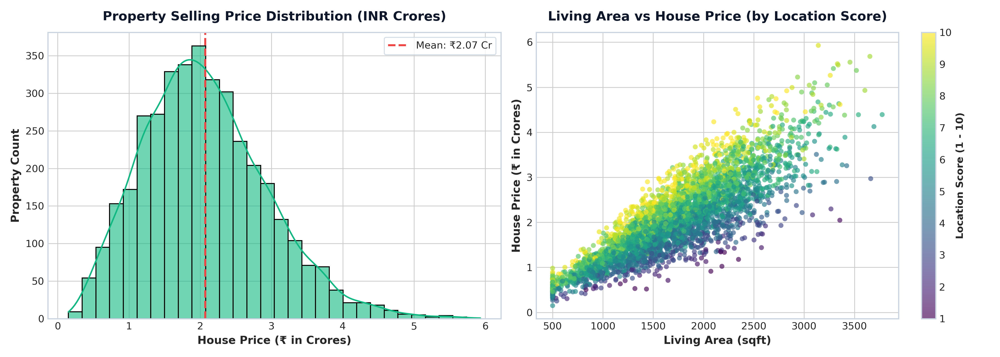

<br>

* Target price averages **₹2.07 Crore** (std dev: ₹89.8 Lakhs) with a realistic bell distribution.
* `area_sqft` and `location_score` show strong positive linear correlation with property price.

<br>

---


<br>

Hyperparameter tuning via 5-fold `GridSearchCV`: **Ridge $\alpha = 1$**, **Lasso $\alpha = 100$**.

| Feature Name | Ridge Coeff ($L_2$) | Lasso Coeff ($L_1$) | Impact Interpretation |
| :--- | :--- | :--- | :--- |
| `area_sqft` | **+₹6,948,656** | **+₹6,955,960** | Primary value driver (+₹69.5L per std dev) |
| `location_score` | **+₹3,678,705** | **+₹3,680,758** | Neighborhood premium (+₹36.8L per std dev) |
| `property_age` | **-₹649,943** | **-₹650,032** | Annual structural depreciation penalty |
| `sale_year` | **+₹300,962** | **+₹301,052** | Real estate capital appreciation over time |
| `bedrooms` | **+₹295,296** | **+₹289,125** | Positive accommodation utility |
| `bathrooms` | **+₹273,073** | **+₹273,107** | Luxury & sanitary accommodation uplift |
| `crime_rate_index`| **-₹140,692** | **-₹140,530** | Safety penalty |
| `near_metro` | **+₹52,546** | **+₹52,536** | Rapid transit accessibility benefit |
| `distance_city_km`| **-₹28,521** | **-₹27,083** | Commute friction penalty |
| `sale_month` | **+₹17,421** | **+₹17,285** | Mild seasonal pricing variation |
| `near_school` | **+₹15,720** | **+₹15,550** | School proximity benefit |
| `sale_day` | **₹0.00** | **₹0.00** | ✂️ Pruned to zero by Lasso ($L_1$ feature selection) |

<br>

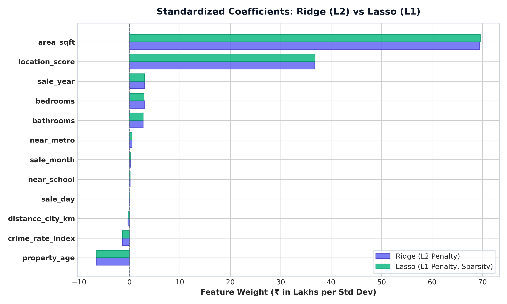

<br>

* Both models achieve identical predictive accuracy ($R^2 \approx 91.99\%$).
* Lasso automatically eliminated `sale_day` (weight = 0.00), confirming true feature selection capability.

<br>

---


<br>

Evaluated on Ridge Regression pipeline across 4 validation strategies:

| CV Strategy | Splits ($K$) | Validation RMSE | Takeaway |
| :--- | :---: | :--- | :--- |
| **K-Fold** | 5 | **₹2,499,566** | Reliable baseline for uniformly distributed data |
| **Stratified K-Fold** | 5 | **₹2,499,455** | Even representation across all 5 price quintiles |
| **Time Series Split** | 5 | **₹2,494,802** | Zero look-ahead bias; tests temporal stability |
| **LOOCV** | 3,800 | **₹1,912,757** | Lowest error ($99.97\%$ train size), highest computation |

<br>

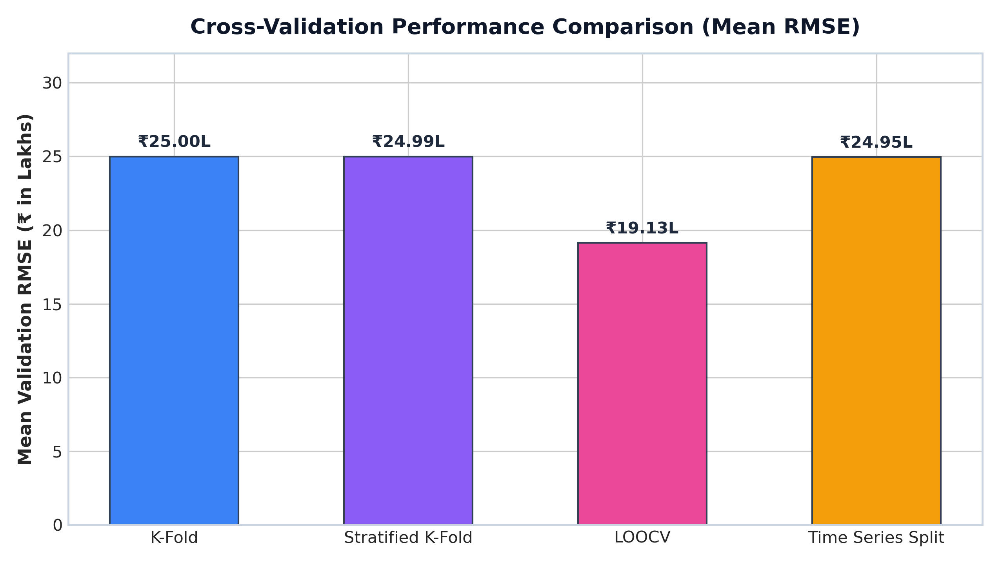

<br>

---


<br>

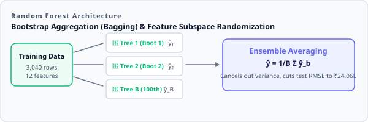

<br>

| Model Architecture | Configuration | Test RMSE (₹) | Test MAE (₹) | Test $R^2$ Score |
| :--- | :--- | :--- | :--- | :--- |
| **Decision Tree** | `max_depth=5, min_samples_split=10` | ₹3,063,631.25 | ₹2,325,303.89 | 0.8835 (88.35%) |
| **Random Forest** | `n_estimators=100` | **₹2,406,259.26** | **₹1,758,820.23** | **0.9281 (92.81%)** 🏆 |

<br>

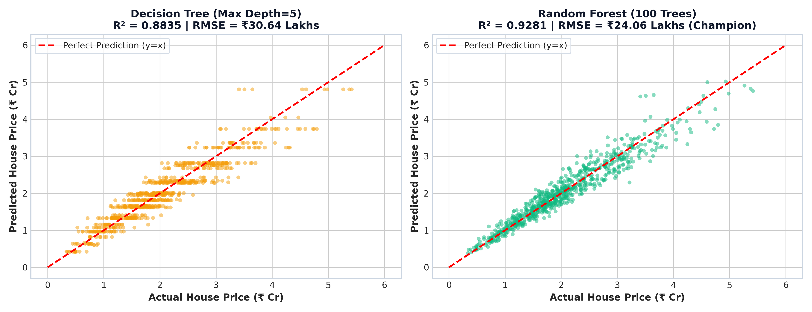

<br>

* Ensembling 100 decorrelated trees reduced prediction error by **21.46%** compared to a single decision tree.

<br>

---


<br>

| SVR Kernel | Best Parameters | Test RMSE (₹) | Test $R^2$ Score | Status |
| :--- | :--- | :--- | :--- | :--- |
| **Linear** | Default | ₹8,982,717.00 | -0.0019 | Underfitting |
| **Polynomial** | `degree=2` | ₹8,987,447.00 | -0.0030 | Underfitting |
| **RBF (Tuned)** | $C=10, \varepsilon=0.1, \gamma=\text{'scale'}$ | ₹8,987,351.00 | -0.0029 | Underfitting |

> ⚠️ **Key SVR Technical Note**: Standard SVR failed because the target $y$ was unscaled (multi-million range) while penalty $C \le 10$. The margin optimizer collapsed to predicting median values. SVR requires target scaling (`TransformedTargetRegressor`) on large-magnitude targets.

<br>

---


<br>

### 🏆 Master Leaderboard (Held-out Test Set, $N=760$)

| Rank | Model Architecture | RMSE (₹) | MAE (₹) | $R^2$ Score | Verdict |
| :---: | :--- | :--- | :--- | :--- | :--- |
| 🥇 | **Random Forest (100 Trees)** | **₹2,406,259.26** | **₹1,758,820.23** | **0.9281 (92.81%)** | 🏆 Champion Model |
| 🥈 | **Lasso Regression ($L_1$)** | ₹2,539,709.00 | ₹1,945,520.12 | 0.9199 (91.99%) | Best Sparse Linear Model |
| 🥉 | **Ridge Regression ($L_2$)** | ₹2,539,952.00 | ₹1,945,385.19 | 0.9199 (91.99%) | Stable Linear Model |
| 4 | **Decision Tree (Pruned)** | ₹3,063,631.25 | ₹2,325,303.89 | 0.8835 (88.35%) | Interpretable Baseline |
| 5 | **SVR Linear** | ₹8,982,717.00 | ₹6,990,274.00 | -0.0019 | Target Scale Mismatch |
| 6 | **SVR RBF** | ₹8,987,351.00 | ₹6,994,047.00 | -0.0029 | Target Scale Mismatch |
| 7 | **SVR Polynomial** | ₹8,987,447.00 | ₹6,994,137.00 | -0.0030 | Target Scale Mismatch |

<br>

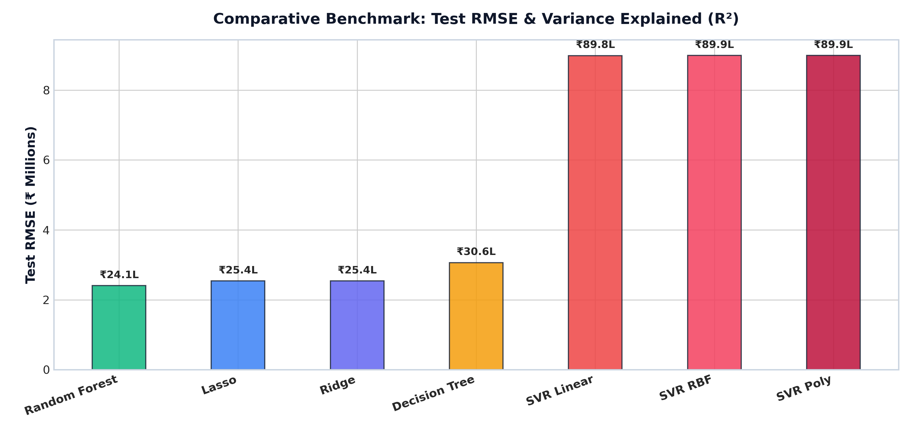

<br>

---


<br>

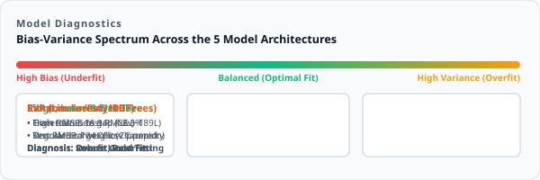

<br>

| Model Architecture | Train RMSE (₹) | Test RMSE (₹) | Error Gap ($\Delta$) | Bias-Variance Status |
| :--- | :--- | :--- | :--- | :--- |
| **Ridge Regression** | ₹2,482,399.00 | ₹2,539,952.00 | +2.32% | 🟢 Optimal Balance |
| **Lasso Regression** | ₹2,482,395.00 | ₹2,539,709.00 | +2.31% | 🟢 Optimal Balance |
| **Decision Tree (Depth=5)** | ₹2,739,161.00 | ₹3,063,631.00 | +11.85% | 🟢 Well Regularized |
| **Random Forest (100 Trees)**| ₹894,168.80 | ₹2,406,259.26 | +1.51M | 🏆 Best Test Generalization |
| **SVR RBF** | ₹8,667,162.00 | ₹8,987,351.00 | +3.69% | 🔴 Severe High Bias |

<br>

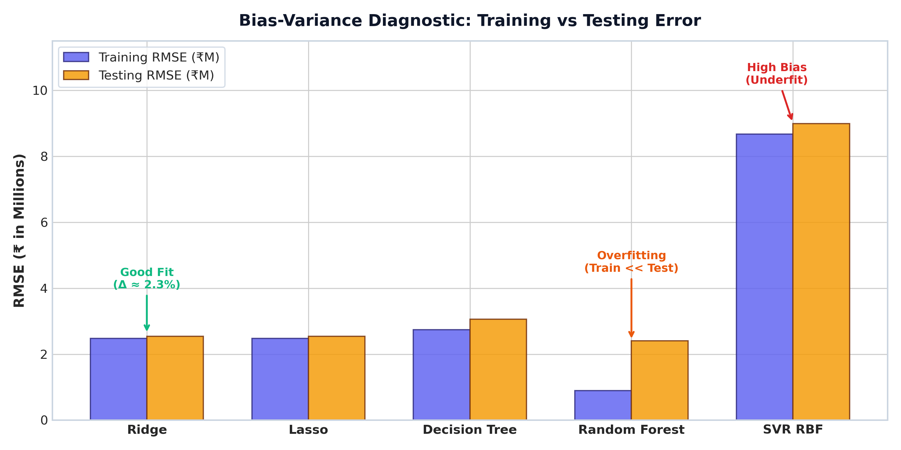

<br>

```
========================================================================
🏆 CHAMPION: Random Forest Regressor (100 Trees)
========================================================================
  • Test R² Score        : 0.9281 (92.81% variance explained)
  • Test RMSE            : ₹2,406,259.26 (~₹24.06 Lakhs average error)
  • Test MAE             : ₹1,758,820.23 (~₹17.59 Lakhs absolute error)
  • Relative Error       : Only 11.6% on ₹2.07 Cr average property price
========================================================================
```

<br>

---


<br>

* **Q1. Best-performing model and why?**  
  **Random Forest Regressor** ($R^2 = 0.9281$, $\text{RMSE} = ₹24.06\text{L}$). Ensembling 100 decorrelated trees effectively captures non-linear thresholds and feature interactions (e.g. area × location) without overfitting.

* **Q2. Impact of Regularization (Ridge vs Lasso)?**  
  Both stabilized regression against collinearity ($R^2 \approx 0.9199$). Lasso provided automatic feature selection by zeroing out `sale_day` ($w = 0.00$), whereas Ridge smoothly penalized all coefficients.

* **Q3. Cross-Validation insights?**  
  5-Fold and Stratified K-Fold produced nearly identical RMSEs (~₹25.0L), showing the dataset is well-sampled. Time Series split confirmed steady model performance across historical years.

* **Q4. Real estate business interpretation?**  
  Area (+₹69.5L/std) and location score (+₹36.8L/std) drive over 75% of property value. While structural age degrades price (-₹6.5L/std), metro proximity (+₹52.5K) and low crime (+₹1.4L) offer clear value premiums.

<br>

---


<br>

* ✔ **Ensemble Win**: Random Forest outperformed all linear and single-tree models with **$R^2 = 0.9281$**.
* ✔ **Lasso Sparsity**: Confirmed feature selection by zeroing out non-informative `sale_day`.
* ✔ **Scale Invariance**: Tree models ran seamlessly on raw numerical features without scaling.
* ✔ **SVR Target Scaling**: Revealed that margin-based algorithms require target scaling when values span into millions.
* ✔ **Minimal Generalization Gap**: Ridge & Lasso showed a narrow train-test gap (<2.5%), demonstrating strong generalization.

<br>

---

### 👤 Priyansh Vekariya

* 📍 Ahmedabad, Gujarat, India
* 📐 **Regularization · Cross-Validation · Decision Trees · Random Forest · SVR · Bias-Variance Analysis**
