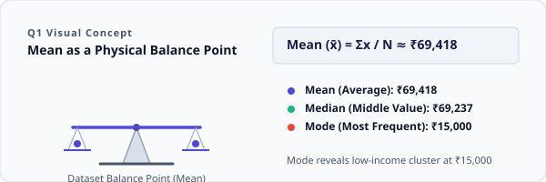
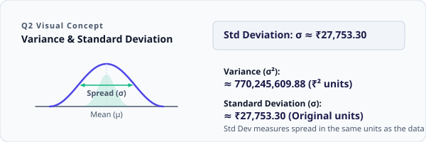
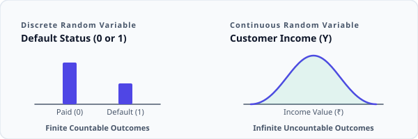
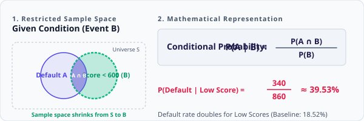
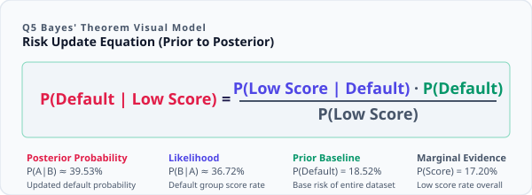
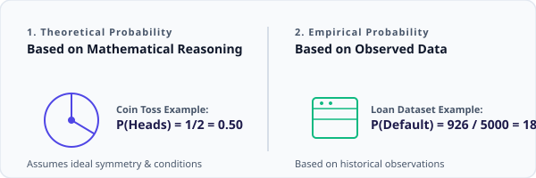
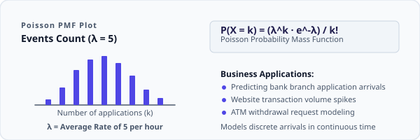
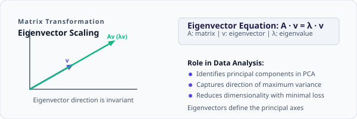

<p align="center">
  
</p>

<br>


<br>

This project is the **Final Examination** for Mathematics for Data Science, applying core concepts of **Statistics, Probability, Distributions, and Linear Algebra** to a real-world Loan Applications dataset (5,000 records × 7 features). The exam covers both theoretical foundations and hands-on practical implementation, demonstrating how mathematical concepts underpin modern data analysis and machine learning.

The implementation is done in Python using a Jupyter Notebook — **[exam.ipynb](exam.ipynb)**.

<br>

---


<br>

<p align="left">
  
  
  
  
  
  
</p>

<br>

---


<br>

### Q1 — Explain Mean, Median, Mode in the context of customer income.

**Mean** is the average income, **Median** is the middle value when sorted, and **Mode** is the most frequent income.

| Measure | Value | Interpretation |
|---------|-------|----------------|
| 📊 **Mean** | ₹69,417.77 | Average customer income |
| 📏 **Median** | ₹69,236.50 | Central value; robust to outliers |
| 🔁 **Mode** | ₹15,000 | Most frequently occurring income; reveals a low-income cluster |

> 💡 **Key Insight**: Mean ≈ Median indicates a roughly symmetric distribution, but Mode = ₹15,000 reveals a cluster of low-income applicants.



---

### Q2 — Differentiate between Standard Deviation and Variance using loan amounts.

| Measure | Value | Unit | Description |
|---------|-------|------|-------------|
| 📦 **Variance** | 770,245,609.88 | ₹² | Average squared deviation from the mean |
| 📐 **Standard Deviation** | ₹27,753.30 | ₹ | Square root of variance; in original units |
| 📏 **Range** | ₹165,807 | ₹ | Difference between max and min loan amounts |

> 💡 **Key Insight**: The high standard deviation (₹27,753) relative to the mean suggests substantial variability in loan amounts across borrowers.



---

### Q3 — What is a Random Variable? Give one example from the dataset.

A **Random Variable** is a numerical quantity whose value depends on a random outcome.

| Type | Example | Values | Description |
|------|---------|--------|-------------|
| 🎲 **Discrete** | `Default_Status` | Yes / No (1 / 0) | Loan default outcome |
| 📈 **Continuous** | `Income` | ₹15,000 – ₹175,000+ | Customer income distribution |



---

### Q4 — Explain Conditional Probability in terms of loan defaults.

**Conditional Probability** P(A|B) is the probability of event A given that event B has occurred.

| Metric | Value | Interpretation |
|--------|-------|----------------|
| 📊 **P(Default)** | 18.52% | Overall default rate |
| ⚠️ **P(Default \| Credit Score < 600)** | 39.53% | Default rate for low credit scores |
| 📈 **Risk Multiplier** | 2.13× | Low-credit borrowers are 2× more likely to default |

```python
low_credit_default = (data["Default_Status"] == "Yes") & (data["Credit_Score"] < 600)
prob_low_credit_default = low_credit_default.sum() / (data["Credit_Score"] < 600).sum()
# Result: 39.53%
```



---

### Q5 — Define Bayes' Theorem and mention how banks can apply it.

**Bayes' Theorem**: P(A|B) = [P(B|A) × P(A)] / P(B)

| Application | Description |
|-------------|-------------|
| 🏦 **Credit Risk Assessment** | Calculate P(Default \| Low Score) from known prior probabilities |
| 🔍 **Fraud Detection** | Update fraud probability as new transaction data arrives |
| 📧 **Spam Filtering** | Classify transactions as legitimate or suspicious |



---

### Q6 — Differentiate between Empirical Probability and Theoretical Probability.

| Type | Definition | Example |
|------|-----------|---------|
| 📐 **Theoretical** | Based on mathematical reasoning | P(Heads in coin flip) = 0.5 |
| 📊 **Empirical** | Based on observed data | Loan default rate = 926/5000 ≈ 18.52% |



---

### Q7 — What is a Poisson Distribution? Give a business example.

**Poisson Distribution** models the count of rare events occurring in a fixed interval of time or space (parameter **λ**).

| Attribute | Detail |
|-----------|--------|
| **Parameter** | λ (lambda) = average rate of occurrence |
| **Business Example** | A bank branch receives ~5 loan applications/hour → predict staffing needs |
| **Formula** | P(X=k) = (λᵏ × e⁻λ) / k! |



---

### Q8 — Eigenvalues and Eigenvectors in data analysis.

For a matrix **A**, an eigenvector **v** satisfies **Av = λv**, where **λ** is the eigenvalue.

| Application | Description |
|-------------|-------------|
| 📊 **PCA** | Dimensionality reduction via principal components |
| 🔗 **Spectral Clustering** | Graph-based clustering using eigenvalues |
| 📉 **Variance Capture** | Eigenvalues indicate variance explained per component |



<br>

---


<br>

### 📥 Task 1 — Import Statements & Data Preview

The dataset is loaded from **[loan_applications.csv](loan_applications.csv)** containing 5,000 customer loan records with 7 features.

| Column | Type | Description |
|--------|------|-------------|
| `Customer_ID` | object | Unique customer identifier (CUST100000…) |
| `Age` | int64 | Customer age |
| `Income` | int64 | Annual income (₹) |
| `Loan_Amount` | int64 | Requested loan amount (₹) |
| `Credit_Score` | int64 | Credit score (426–850) |
| `Loan_Term` | int64 | Loan tenure in months |
| `Default_Status` | object | Default outcome (Yes / No) |

```python
import numpy as np
import pandas as pd
import matplotlib.pyplot as plt
from scipy.stats import norm
import scipy.stats as stats

data = pd.read_csv("loan_applications.csv")
display(data.head())
```


<br>

---

### 📊 Task 2 — Central Tendency & Dispersion

Computed **Mean**, **Median**, **Mode** for `Income` and **Range**, **Variance**, **Standard Deviation** for `Loan_Amount`:

| Statistic | Column | Value |
|-----------|--------|-------|
| 📊 **Mean** | `Income` | 69,417.77 |
| 📏 **Median** | `Income` | 69,236.50 |
| 🔁 **Mode** | `Income` | 15,000 |
| 📐 **Range** | `Loan_Amount` | 165,807 |
| 📦 **Variance** | `Loan_Amount` | 770,245,609.88 |
| 📈 **Std Dev** | `Loan_Amount` | 27,753.30 |

```python
# Central Tendency
mean_income = data['Income'].mean()        # 69,417.77
median_income = data['Income'].median()    # 69,236.50
mode_income = data['Income'].mode()[0]     # 15,000

# Dispersion
range_loan = data['Loan_Amount'].max() - data['Loan_Amount'].min()  # 165,807
variance_loan = data['Loan_Amount'].var()                            # 770,245,609.88
std_loan = data['Loan_Amount'].std()                                 # 27,753.30
```


<br>

---

### 🎲 Task 3 — Probability & Events

Calculated default probability, built a contingency table between `Default_Status` and `Credit_Score` bins, and computed conditional probability:

| Analysis | Result |
|----------|--------|
| **P(Default)** | 0.1852 (18.52%) |
| **P(Default \| Credit Score < 600)** | 0.3953 (39.53%) |

**Contingency Table (Default_Status × Credit_Score bins):**

| Default_Status | (425, 567] | (567, 709] | (709, 850] |
|----------------|-----------|-----------|-----------|
| **No** | 153 | 2,416 | 1,505 |
| **Yes** | 92 | 583 | 251 |

```python
# Default probability
default_count = (data["Default_Status"] == "Yes").sum()
prob_default = default_count / len(data)   # 0.1852

# Contingency table
contingency_table = pd.crosstab(data["Default_Status"], pd.cut(data["Credit_Score"], bins=3))

# Conditional probability
low_credit_default = (data["Default_Status"] == "Yes") & (data["Credit_Score"] < 600)
prob_low_credit_default = low_credit_default.sum() / (data["Credit_Score"] < 600).sum()
# 39.53%
```


<br>

---

### 📉 Task 4 — Distribution & Visualization

Generated two key visualizations and computed distribution shape metrics:

| Metric | Column | Value | Interpretation |
|--------|--------|-------|----------------|
| 📈 **Skewness** | `Loan_Amount` | 0.79 | Right-skewed; some borrow much more |
| 📦 **Kurtosis** | `Loan_Amount` | 0.29 | Platykurtic; fewer extreme outliers |

**Visualizations Generated:**

| Plot | Description |
|------|-------------|
| 📊 **Normal Distribution Overlay** | Credit Score histogram with fitted normal curve |
| 📈 **QQ Plot** | Income normality check — confirms approximate normality |

```python
# Normal Distribution Overlay on Credit Score
plt.figure(figsize=(10, 6))
plt.hist(data["Credit_Score"], bins=30, density=True, alpha=0.4, color='black')
x = np.linspace(data["Credit_Score"].min(), data["Credit_Score"].max(), 100)
y = norm.pdf(x, data["Credit_Score"].mean(), data["Credit_Score"].std())
plt.plot(x, y, color='red')
plt.show()

# QQ Plot for Income
stats.probplot(data['Income'], dist="norm", plot=plt)
plt.title("QQ Plot for Income")
plt.show()
```


<br>

---

### 🔢 Task 5 — Linear Algebra Applications

Applied vector operations to customer financial profiles (`Income`, `Loan_Amount`):

| Operation | Result | Interpretation |
|-----------|--------|----------------|
| 🔵 **Dot Product** (Customer 1 & 2) | 22,664,223,807 | Measures financial profile similarity |
| 📏 **L2 Norm** (Customer 1) | 140,359.48 | Financial magnitude of Customer 1 |
| 📐 **Angle** (Customer 1 & 2) | 15.62° | Very similar borrowing-to-income profiles |

```python
customer_vectors = data[['Income', 'Loan_Amount']].head(5)

# Dot Product
dot_product = np.dot(customer_vectors.iloc[0], customer_vectors.iloc[1])
# 22,664,223,807

# L2 Norm
norm_2 = np.linalg.norm(customer_vectors.iloc[0], ord=2)
# 140,359.48

# Angle Between Vectors
angle = np.arccos(dot_product / (np.linalg.norm(customer_vectors.iloc[0]) * np.linalg.norm(customer_vectors.iloc[1])))
# 15.62°
```


<br>

---


<br>

*   ✔ **High Default Risk in Low Credit Scores**: Customers with Credit Score < 600 have a **39.53%** chance of default — more than double the overall rate of 18.52%.
*   ✔ **Symmetric Income Distribution**: Mean (₹69,418) and Median (₹69,237) are nearly identical, but Mode (₹15,000) reveals a cluster of low-income applicants.
*   ✔ **Right-Skewed Loan Amounts**: Skewness of **0.79** indicates some customers borrow significantly more than average; Kurtosis of **0.29** shows fewer extreme outliers.
*   ✔ **Customer Profile Similarity**: The **15.62°** angle between Customer 1 and 2's financial vectors shows very similar borrowing-to-income profiles.
*   ✔ **Normal Income Distribution**: The QQ Plot confirms income is approximately normally distributed, validating parametric statistical tests.

<br>

---


<br>

### 📊 Key Findings

*   ✔ **Central Tendency**: Mean Income ≈ ₹69,418 | Median ≈ ₹69,237 | Mode = ₹15,000
*   ✔ **Dispersion**: Loan Amount Range = ₹165,807 | Std Dev ≈ ₹27,753
*   ✔ **Default Probability**: Overall = 18.52% | Low Credit Score = 39.53%
*   ✔ **Distribution Shape**: Skewness = 0.79 (right-skewed) | Kurtosis = 0.29 (platykurtic)
*   ✔ **Vector Analysis**: Dot Product = 22,664,223,807 | L2 Norm = 140,359.48 | Angle = 15.62°

### 🎯 Final Conclusion

This examination successfully applied core Mathematics for Data Science concepts to the Loan Applications dataset. Statistical measures (mean, median, mode, variance, standard deviation) provided insights into customer income and loan distributions. Probability analysis revealed that low credit scores are a strong predictor of loan default. Distribution visualization confirmed approximate normality in income data. Linear algebra techniques (vector operations, norms, dot products) demonstrated how customer financial profiles can be mathematically compared for segmentation and risk assessment.

<br>

---

### 👤 Priyansh Vekariya

*   📍 Ahmedabad, Gujarat, India
*   ⭐ If you found this project useful, give it a star and feel free to fork!
*   📐 **Statistics · Probability · Distributions · Linear Algebra**
