  

This project applies fundamental and advanced **Linear Algebra** concepts to represent, analyze, and transform a student performance dataset. By mapping students' subject scores to vectors and matrices, we perform operations like projections, norms, decompositions (LU, SVD), and dimensionality reduction (PCA, LDA) to extract meaningful academic insights.

The implementation is done in Python using a Jupyter Notebook.

---

  
  
  
  
  
  
  
  

---

### 📐 Part A: Vector & Matrix 

### 🧮 Part B: Vector Operations

### 🌐 Part C: Linear Transformations & Geometry
Interpreting geometric subspaces spanned by student databases:
###   *Line (1D/2D Subspace)*
   

###   *Plane (3D Subspace)*
   

###   *Hyperplane ($N$-D Space)*
   

### 🔑 Part D: Eigenvalues

### 📉 Part E: Dimensionality Reduction
###   **Principal Component Analysis (PCA)**
   

###   **Linear Discriminant Analysis (LDA)**
   

###   **PCA vs LDA**
   

---

### 📊 Key Findings

*   ✔ **Vector Norms**: L2 Norm successfully quantified overall academic strength, showing Student A leads in score magnitude.
*   ✔ **Profile Similarity**: Vector angle showed Student A and Student B have highly correlated relative subject strengths ($11.59^\circ$ separation).
*   ✔ **Matrix Invertibility**: Matrix determinant confirmed that the student-subject vector spaces are linearly independent and invertible.
*   ✔ **Efficient Computation**: LU decomposition split the matrix into triangular components for fast computational solvability.
*   ✔ **Decomposition Analysis**: SVD successfully factored the grade matrix to highlight singular values ($\vec{\sigma} = [246.197, 19.957, 8.467]$).
*   ✔ **Principal Component**: PCA successfully captured over 99.4% of academic variance in the first principal component, representing general capability.
*   ✔ **Supervised Separation**: LDA successfully partitioned passing and failing students into clearly separated coordinate clusters.
*   ✔ **Data Extraction**: Linear algebra methods successfully transformed healthcare/student data into evidence-based insights.

### 🎯 Final Conclusion

This project successfully applied fundamental and advanced Linear Algebra techniques to a student performance database. Mathematical analyses including vector norms, projections, similarity matrix multiplication, covariance mapping, eigensystem extraction, LU/SVD matrix decompositions, PCA, and LDA were used to evaluate student-related academic dimensions.

The results showed that while students share highly similar relative academic distributions, they differ in absolute performance magnitude. Additionally, overall academic capability accounts for over 99% of total score variance, while supervised LDA projection provides a clean classification boundary for passing and failing thresholds.

Overall, the project demonstrates how Linear Algebra methods can transform multidimensional student records into visualizable, mathematically sound student profiles to support informed academic evaluations.

---

### 👤 Priyansh Vekariya

*   📍 Ahmedabad, Gujarat, India
*   ⭐ If you found this project helpful, give it a star and feel free to fork!
*   📐 **Linear Algebra · Dimensionality Reduction · Matrix Decompositions**

